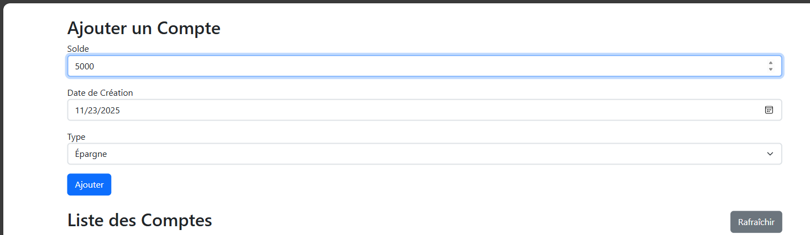
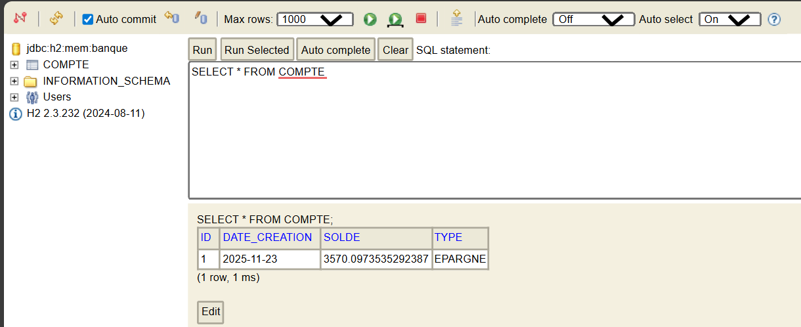
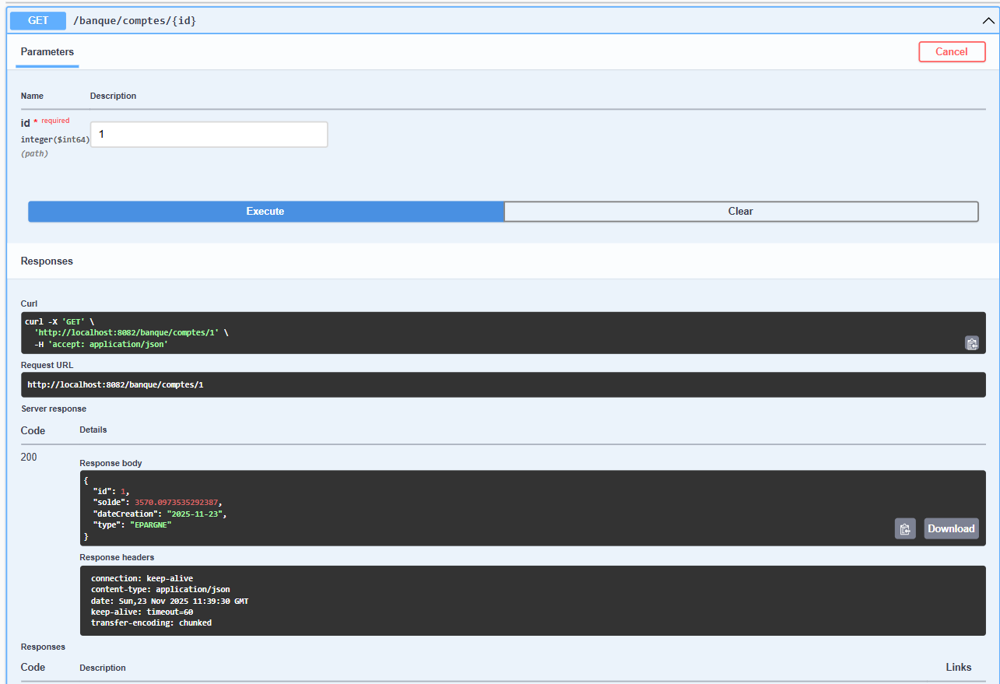

# TP 9 : Client React pour API REST

## Captures d'Écran

*Test de l'API REST avec Swagger UI - Récupération d'un compte par ID*

*Visualisation des données dans la console H2 - Table COMPTE avec les comptes*

*Interface React avec formulaire d'ajout et liste des comptes bancaires*
